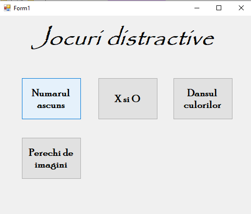
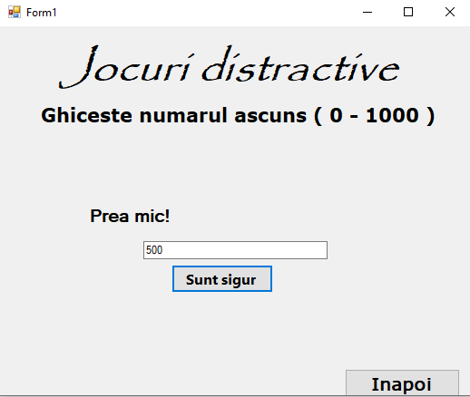
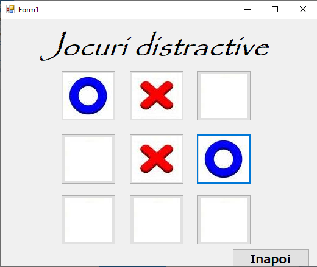
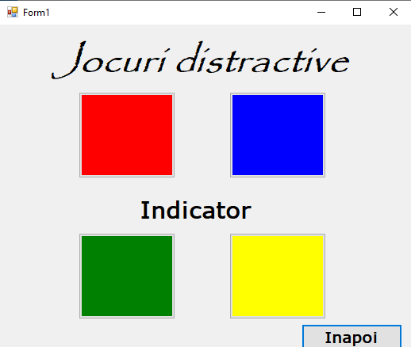

# MiniGames
C# project includes some interesting games.
- Guess the number (Given a rondom number, use the least amount of guesses to discover it)
- Tic-tac-toe (only multiplayer)
- Dance of colours (memory game to reproduce a set of colours in order)

